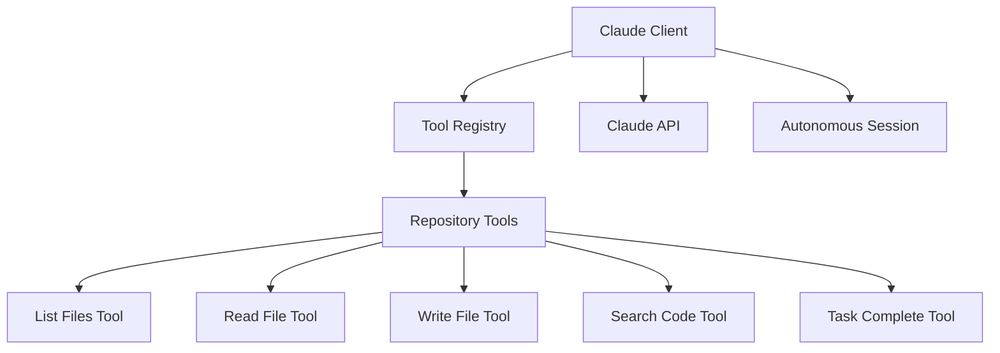

# Claude Client Implementation

## Overview

The Claude client is a core component of the Cody Batch system, responsible for interacting with the Claude 3.7 API to analyze code and generate changes. It provides a tool-based interface that allows Claude to explore repositories, read and write files, and search for patterns in the code.

## Architecture

The Claude client follows a tool-based architecture where Claude can request specific operations through a defined set of tools. This approach allows Claude to interact with the repository in a controlled and structured manner.

## Key Components

### ClaudeClient

The main client class that handles communication with the Claude API. It provides methods for:

- Running autonomous sessions
- Tracking token usage
- Managing conversation history

The client uses the Anthropic SDK to communicate with the Claude API and implements a tool-based interaction model.

### Tool Registry

A registry for all tools that Claude can use. It provides methods for:

- Registering tools
- Getting tool definitions
- Executing tools

The registry acts as a central hub for all tool operations and ensures that tools are properly registered and executed.

### Repository Tools

A set of tools that allow Claude to interact with the repository:

1. **ListFilesTool**: Lists files in a directory within the repository
2. **ReadFileTool**: Reads the contents of a file
3. **WriteFileTool**: Writes content to a file
4. **SearchCodeTool**: Searches for patterns in the repository code
5. **TaskCompleteTool**: Indicates that the task is complete and provides a summary of changes

Each tool has a defined input and output schema using Zod for validation.

### Claude Context

A context object that is passed to tools during execution. It contains:

- The Claude client instance
- The repository path
- The session ID
- Additional context data

## Autonomous Processing

The Claude client implements an autonomous processing model where Claude can analyze code and make changes without user intervention. The process works as follows:

1. The user provides a prompt describing the task
2. Claude analyzes the prompt and uses tools to explore the repository
3. Claude makes changes to the repository using the write_file tool
4. Claude indicates completion using the task_complete tool
5. The system returns the conversation history and token usage

The autonomous session has a configurable maximum number of iterations to prevent infinite loops and excessive token usage.

## Tool-Based Interaction

The tool-based interaction model allows Claude to:

1. Request specific operations through defined tools
2. Receive structured responses from tools
3. Make decisions based on tool responses
4. Execute multiple tools in sequence to accomplish a task

This approach provides a controlled and structured way for Claude to interact with the repository, ensuring that operations are well-defined and validated.

## Error Handling

The Claude client implements comprehensive error handling:

1. Tool execution errors are caught and reported back to Claude
2. API errors are caught and logged
3. Invalid inputs are rejected through schema validation
4. Timeouts and rate limits are handled gracefully

## Token Usage Tracking

The Claude client tracks token usage for each session:

1. Input tokens
2. Output tokens
3. Cache creation tokens
4. Cache read tokens
5. Total tokens

This information is used for cost management and optimization.

## Integration with Batch Processing

The Claude client is integrated with the batch processing system:

1. The batch processor creates a Claude client instance
2. The batch processor provides the repository path and prompt
3. The Claude client runs an autonomous session
4. The batch processor receives the results and creates pull requests or diffs

## Security Considerations

The Claude client implements several security measures:

1. File operations are limited to the specified repository path
2. Input validation using Zod schemas
3. Controlled tool execution through the registry
4. No execution of arbitrary code

## Performance Optimization

The Claude client includes several performance optimizations:

1. Efficient file operations
2. Structured tool responses
3. Token usage tracking for optimization
4. Configurable maximum iterations

## Future Enhancements

Potential future enhancements for the Claude client:

1. Additional tools for more complex operations
2. Improved prompt engineering
3. Better context management for large repositories
4. Enhanced error recovery mechanisms
5. Support for multiple Claude models